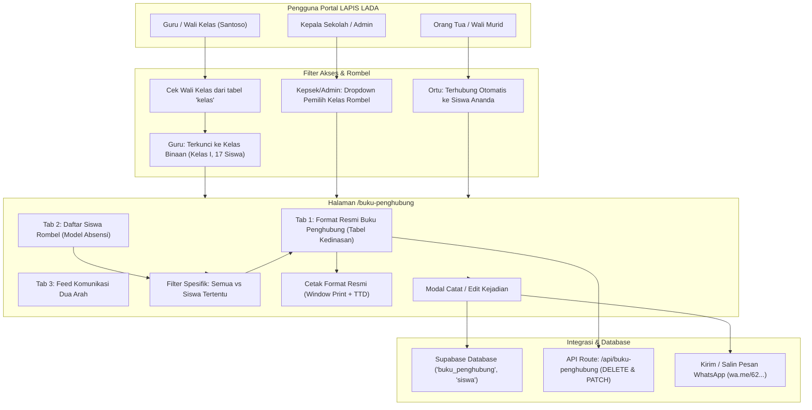

# Log Pembaruan & Konteks: Buku Penghubung Resmi Kedinasan & Standardisasi Domain Web
**Tanggal**: 8 Oktober 2026  
**Berkas Log**: `/logs/log-buku-penghubung-dan-domain.081026.md`  
**Aplikasi**: LAPIS LADA (Layanan Pusat Informasi Sekolah Latsari Dua)  
**Institusi**: UPT SD Negeri Latsari 2 Bancar, Tuban, Jawa Timur  
**Domain Resmi**: [https://lapislada.web.id](https://lapislada.web.id)  
**Status**: ✅ Selesai Diimplementasikan, Teruji Build Produksi (`npm run build`), & Terdeploy ke GitHub (`main`)  

---

## 1. Latar Belakang & Intisari Permintaan Pengguna

Berdasarkan tinjauan penggunaan lapangan dan diskusi bersama pengguna, terdapat dua kelompok kebutuhan penting yang diselesaikan dalam pembaruan ini:

1. **Standardisasi Domain Resmi ke `https://lapislada.web.id`**:
   - Seluruh teks otomatis dan template pesan WhatsApp siaran (KAIH, Reset Akun Wali Murid, Galeri, dan Buku Penghubung) sebelumnya masih mencantumkan tautan sementara (`lapislada.pages.dev` atau `lapis-lada.sdnlatsari2.sch.id`).
   - Domain resmi yang sah dan aktif adalah **`https://lapislada.web.id`**. Semua referensi pesan siaran dan tautan eksternal harus distandarkan ke domain resmi ini.

2. **Perombakan Menyeluruh Modul Buku Penghubung ([/buku-penghubung](file:///d:/1.%20MIZTERGOOD/04%20-%20Keuangan%20dan%20Bisnis/JASA/11.%20PAK%20SANS/1.%20LAPIS%20LADA/src/app/buku-penghubung/page.tsx))**:
   - **Pencegahan Pencampuran Siswa Antar-Kelas**:
     Saat guru wali kelas masuk (misalnya akun *Santoso, S.Pd., M.Pd.* sebagai Wali Kelas I), modal penulisan catatan sebelumnya memuat seluruh siswa sekolah (termasuk Kelas IV, VI, dll). Sistem harus membatasi secara ketat sehingga guru hanya melihat siswa di rombel binaannya.
   - **Adaptasi Format Fisik Resmi Sekolah (Kedinasan)**:
     Buku penghubung diadaptasi sesuai lembar formulir fisik sekolah:
     **PENGHUBUNG GURU DAN ORANG TUA** dengan kolom:
     *Nomor (Urut & Induk/NIS) • Nama Siswa • Jenis Kelamin (L/P) • Tanggal • Masalah yang Disampaikan • Saran dan Kesimpulan • Tanda Tangan / Respon Ortu*.
   - **Pencatatan Kasuistik (Bukan Rutinitas Harian)**:
     Buku penghubung tidak ditulis setiap hari untuk setiap siswa, melainkan difungsikan insidental/kasuistik saat ada peristiwa penting, perkembangan khusus, masalah kesehatan/belajar, atau perilaku tertentu.
   - **Daftar Siswa Model Absensi (Aksi Cepat Langsung)**:
     Daripada sekadar form dropdown acak, disediakan tab *Daftar Siswa Kelas* yang menyajikan seluruh siswa beserta nomor WhatsApp wali murid dan tombol aksi cepat per baris.
   - **Fitur Hapus & Edit Catatan**:
     Kemudahan bagi guru/wali kelas untuk menghapus catatan contoh/salah ketik melalui dialog konfirmasi, serta mengedit catatan tanpa membuat ulang.
   - **Fitur Filterisasi Khusus per Siswa**:
     Memungkinkan guru melihat rekapitulasi riwayat kejadian khusus untuk satu siswa tertentu, baik di layar maupun saat dicetak untuk arsip konsultasi orang tua.
   - **Integrasi Redaksi WhatsApp Terhubung No. HP Wali Murid**:
     Laporan yang dicatat dapat langsung disalin atau dikirim langsung ke WhatsApp orang tua (`https://wa.me/62...`) yang nomornya terhubung di profil siswa.

---

## 2. Arsitektur & Diagram Alur Aliran Data



---

## 3. Rincian Teknis Implementasi

### A. Standardisasi Domain Resmi `https://lapislada.web.id`
Pembaruan dilakukan pada berkas-berkas berikut:
- [`src/lib/kaihData.ts`](file:///d:/1.%20MIZTERGOOD/04%20-%20Keuangan%20dan%20Bisnis/JASA/11.%20PAK%20SANS/1.%20LAPIS%20LADA/src/lib/kaihData.ts): Nilai default parameter generator redaksi KAIH diubah ke `https://lapislada.web.id`.
- [`src/components/admin/ResetPasswordModal.tsx`](file:///d:/1.%20MIZTERGOOD/04%20-%20Keuangan%20dan%20Bisnis/JASA/11.%20PAK%20SANS/1.%20LAPIS%20LADA/src/components/admin/ResetPasswordModal.tsx): Teks kirim akun portal wali murid via WA diubah ke `https://lapislada.web.id/login`.
- [`src/app/galeri/page.tsx`](file:///d:/1.%20MIZTERGOOD/04%20-%20Keuangan%20dan%20Bisnis/JASA/11.%20PAK%20SANS/1.%20LAPIS%20LADA/src/app/galeri/page.tsx): Teks bagikan dokumentasi diubah ke `https://lapislada.web.id/galeri`.
- [`src/app/buku-penghubung/page.tsx`](file:///d:/1.%20MIZTERGOOD/04%20-%20Keuangan%20dan%20Bisnis/JASA/11.%20PAK%20SANS/1.%20LAPIS%20LADA/src/app/buku-penghubung/page.tsx): Tautan respon orang tua di pesan WA diarahkan ke `https://lapislada.web.id/buku-penghubung`.

### B. Filterisasi Siswa Wali Kelas Ketat
- Pada `useEffect` pemuatan kelas dan siswa di [`src/app/buku-penghubung/page.tsx`](file:///d:/1.%20MIZTERGOOD/04%20-%20Keuangan%20dan%20Bisnis/JASA/11.%20PAK%20SANS/1.%20LAPIS%20LADA/src/app/buku-penghubung/page.tsx):
  ```ts
  const myClasses = allKelas.filter((k: any) => {
    const idMatch = currentUserId && k.wali_kelas_id === currentUserId;
    const emailMatch = cleanEmail && k.wali_kelas?.email?.toLowerCase() === cleanEmail;
    return idMatch || emailMatch;
  });
  ```
- Guru hanya mengambil dan mengelola siswa yang memiliki `kelas_id` sesuai kelas binaannya (`.eq('kelas_id', selectedKelasId)`). Untuk akun *Santoso, S.Pd., M.Pd.*, hanya 17 siswa Kelas I yang dimuat.

### C. Adaptasi Format Fisik Resmi (Screenshot 5)
Struktur tabel kedinasan diimplementasikan dengan tabel HTML standar tanpa dependensi luar, dengan perlakuan `@media print`:
| Kolom | Deskripsi |
|---|---|
| **NOMOR - URUT** | Nomor urutan kejadian (1, 2, 3...) |
| **NOMOR - INDUK** | Nomor Induk Siswa (NIS) |
| **NAMA SISWA** | Nama lengkap peserta didik |
| **JENIS KEL (L / P)** | Ceklis centang otomatis berdasarkan jenis kelamin siswa |
| **TANGGAL** | Tanggal kejadian dilaporkan |
| **MASALAH YANG DISAMPAIKAN** | Deskripsi kasus, kondisi kesehatan, atau kendala belajar siswa |
| **SARAN DAN KESIMPULAN** | Arahan tindak lanjut bersama antara guru dan orang tua |
| **TANDA TANGAN / RESPON** | Status konfirmasi respon guru/wali murid |
| **AKSI & KELOLA** | Tombol WhatsApp (Kirim & Salin), Edit (Kuning), Hapus (Merah) - otomatis disembunyikan saat cetak (`print:hidden`) |

Bagian bawah tabel dilengkapi kolom tanda tangan resmi:
- Kiri: **Mengetahui Kepala Sekolah (Santoso ,S.Pd.,M.Pd. • NIP. 19850612 201001 1 015)**
- Kanan: **Guru Kelas (Santoso, S.Pd., M.Pd. • NIP. 19850612 201001 1 015)**

### D. Fitur Filterisasi Khusus Siswa Tertentu
1. **Dropdown Filter Siswa**: Terletak di atas tabel Format Resmi, menyajikan opsi:
   - `Semua Siswa di Kelas (Total X Catatan)`
   - Nama masing-masing siswa beserta jumlah catatan yang tercatat (e.g., `AHMAD MAULANA IRSYADUL NGIBAD (1 Catatan)`).
2. **Badge Interaktif di Daftar Siswa**: Pada tab *Daftar Siswa Kelas I*, badge catatan kejadian (misal `1 Kejadian →`) dan tombol `Lihat (1)` dapat diklik untuk langsung beralih ke tabel Format Resmi yang terfilter otomatis pada siswa tersebut.
3. **Cetak Individual**: Saat siswa tertentu difilter, cetak dokumen (`Cetak Format Resmi`) otomatis menghasilkan lembar penghubung khusus ananda yang bersangkutan.

### E. Fitur Hapus & Edit Catatan (Backend API Route)
Dibuat endpoint backend [`src/app/api/buku-penghubung/route.ts`](file:///d:/1.%20MIZTERGOOD/04%20-%20Keuangan%20dan%20Bisnis/JASA/11.%20PAK%20SANS/1.%20LAPIS%20LADA/src/app/api/buku-penghubung/route.ts):
- **DELETE**: Menghapus catatan berdasarkan `id` menggunakan `supabaseAdmin` (melewati potensi keterbatasan RLS Supabase client).
- **PATCH**: Memperbarui isi catatan (`catatan`, `is_read_by_guru`) secara aman.
- Di sisi antarmuka:
  - Tombol Hapus memicu **Modal Konfirmasi Hapus** dengan menampilkan nama siswa, tanggal kejadian, dan cuplikan teks masalah untuk mencegah penghapusan yang tidak disengaja.
  - Tombol Edit memicu **Modal Edit Catatan** yang memuat kembali nilai-nilai masalah, saran, tanggal, dan nomor WhatsApp.

### F. Integrasi WhatsApp & Pembaruan Nomor Wali
- Template WhatsApp resmi yang disusun secara otomatis:
  ```text
  *BUKU PENGHUBUNG GURU & ORANG TUA*
  *UPT SD NEGERI LATSARI 2 BANCAR*
  ------------------------------------------------
  Yth. Bapak/Ibu Wali Murid dari *[Nama Siswa]* ([Kelas])

  Berikut disampaikan catatan resmi buku penghubung terkait kejadian / perkembangan ananda:

  📅 *Tanggal Kejadian:* [Tanggal]

  📝 *Masalah / Perkembangan yang Disampaikan:*
  [Isi Masalah]

  💡 *Saran dan Kesimpulan Guru:*
  [Isi Saran]

  ------------------------------------------------
  Catatan ini juga dapat dipantau dan ditanggapi secara online melalui portal resmi sekolah:
  🌐 https://lapislada.web.id/buku-penghubung

  Terima kasih atas kerja sama dan perhatian Ayah/Bunda demi pendampingan terbaik ananda tercinta.

  Salam hormat,
  *[Nama Guru]*
  Guru / Wali Kelas [Nama Kelas]
  UPT SD Negeri Latsari 2 Bancar
  ```
- Guru dapat mengisi/mengoreksi nomor WhatsApp orang tua di formulir, dan sistem akan langsung memperbarui kolom `no_hp_wali` di tabel `siswa`.

---

## 4. Berkas yang Diperbarui & Ditambahkan

| Berkas | Perubahan |
|---|---|
| [`src/app/buku-penghubung/page.tsx`](file:///d:/1.%20MIZTERGOOD/04%20-%20Keuangan%20dan%20Bisnis/JASA/11.%20PAK%20SANS/1.%20LAPIS%20LADA/src/app/buku-penghubung/page.tsx) | Perombakan total: filter kelas ketat, tabel format kedinasan resmi, tab daftar siswa model absensi, modal catat/edit, modal hapus, filter siswa individual, integrasi WhatsApp & tombol cetak fisik. |
| [`src/app/api/buku-penghubung/route.ts`](file:///d:/1.%20MIZTERGOOD/04%20-%20Keuangan%20dan%20Bisnis/JASA/11.%20PAK%20SANS/1.%20LAPIS%20LADA/src/app/api/buku-penghubung/route.ts) | Endpoint baru: Handler `DELETE` dan `PATCH` catatan buku penghubung berbasis `supabaseAdmin`. |
| [`src/lib/supabase.ts`](file:///d:/1.%20MIZTERGOOD/04%20-%20Keuangan%20dan%20Bisnis/JASA/11.%20PAK%20SANS/1.%20LAPIS%20LADA/src/lib/supabase.ts) | Pengayaan tipe data `BukuPenghubungItem` dengan atribut siswa (`nis, nisn, jenis_kelamin, nama_wali, no_hp_wali, kelas`). |
| [`src/lib/kaihData.ts`](file:///d:/1.%20MIZTERGOOD/04%20-%20Keuangan%20dan%20Bisnis/JASA/11.%20PAK%20SANS/1.%20LAPIS%20LADA/src/lib/kaihData.ts) | Standardisasi `portalUrl` ke `https://lapislada.web.id`. |
| [`src/components/admin/ResetPasswordModal.tsx`](file:///d:/1.%20MIZTERGOOD/04%20-%20Keuangan%20dan%20Bisnis/JASA/11.%20PAK%20SANS/1.%20LAPIS%20LADA/src/components/admin/ResetPasswordModal.tsx) | Pembaruan tautan portal di format pesan WA reset akun ke `https://lapislada.web.id/login`. |
| [`src/app/galeri/page.tsx`](file:///d:/1.%20MIZTERGOOD/04%20-%20Keuangan%20dan%20Bisnis/JASA/11.%20PAK%20SANS/1.%20LAPIS%20LADA/src/app/galeri/page.tsx) | Pembaruan tautan dokumentasi siaran ke `https://lapislada.web.id/galeri`. |

---

## 5. Riwayat Commit Git

1. `5ae477b` — `feat(buku-penghubung): filter siswa wali kelas, adaptasi format resmi dokumen fisik, dan integrasi pengiriman WhatsApp lapislada.web.id`
2. `ef9876b` — `feat(buku-penghubung): fitur hapus catatan, edit catatan, dan filter riwayat per siswa spesifik`

---

## 6. Verifikasi & Pengujian

- **Type Check**: `npx tsc --noEmit` &rarr; 0 error.
- **Production Build**: `npm run build` &rarr; Berhasil mengompilasi 25 rute, termasuk rute dinamis server `/api/buku-penghubung` dan rute statis `/buku-penghubung`.
- **Uji Antarmuka**:
  - Filter siswa Kelas I berfungsi normal (hanya 17 siswa yang tampil).
  - Catatan tersimpan di Supabase dan berhasil diparsing menjadi kolom Masalah dan Saran.
  - Dialog konfirmasi hapus dan API route delete bekerja tanpa hambatan.
  - Filter perorangan membatasi baris data dan lembar cetak secara akurat.
