# Log Pembaruan & Konteks: Transisi 100% Full-Cloud Supabase & Perbaikan Navigasi Mobile
**Tanggal**: 9 Oktober 2026  
**Berkas Log**: `/logs/log-full-cloud-migration-dan-mobile-fix.091026.md`  
**Aplikasi**: LAPIS LADA (Layanan Pusat Informasi Sekolah Latsari Dua)  
**Institusi**: UPT SD Negeri Latsari 2 Bancar, Tuban, Jawa Timur  
**Domain Resmi**: [https://lapislada.web.id](https://lapislada.web.id)  
**Status**: ✅ Selesai Diimplementasikan, Teruji Build Produksi (`npm run build`), & Terdeploy ke GitHub (`main`)

---

## 1. Latar Belakang & Intisari Permintaan Pengguna

Berdasarkan tinjauan arsitektur sistem dan masukan pengguna, dilakukan serangkaian audit, refactoring besar, dan pemecahan masalah teknis:

1. **Transisi 100% Full-Cloud Murni (Bebas Mock Data & Offline-Only Storage)**:
   - Sebelumnya, beberapa menu sekunder (seperti Galeri Kegiatan, Pengumuman, Dokumen BOS, Jenis Asesmen, dan Pembiasaan Karakter KAIH) masih menggunakan data percontohan statis (*fallback dummy data*) atau menyimpan perubahan sementara di `localStorage` peramban lokal.
   - Hal tersebut menyebabkan ketidaksinkronan data: misalnya perubahan foto galeri di portal admin tidak langsung terlihat di peramban publik pengunjung lain.
   - Pengguna menginstruksikan agar **seluruh modul di aplikasi LAPIS LADA 100% tersimpan dan tersinkronisasi di cloud database Supabase PostgreSQL**.

2. **Perbaikan Double Hamburger Menu pada Tampilan Ponsel (Mobile View)**:
   - Pada viewport layar ponsel (`< 768px`), pengguna mendapati adanya dua ikon menu tiga garis (hamburger) sekaligus: satu di pojok kiri atas (pada bilah header aplikasi) dan satu di pojok kanan bawah (pada bilah navigasi bawah / *BottomNav*).
   - Hal ini membingungkan alur navigasi dan memboroskan ruang antarmuka. Navigasi mobile perlu dirapikan dengan memusatkan pemicu drawer menu pada bilah navigasi bawah (*thumb-friendly*).

3. **Penyelidikan & Penanganan Error HTTP 400 di Console Browser**:
   - Console Developer Tools menampilkan galat berulang:  
     `Failed to load resource: the server responded with a status of 400 () .../rest/v1/buku_penghubung?*&dibaca=eq.false`
   - Galat ini terjadi karena query penghitungan pesan belum dibaca di [AppShell.tsx](file:///d:/1.%20MIZTERGOOD/04%20-%20Keuangan%20dan%20Bisnis/JASA/11.%20PAK%20SANS/1.%20LAPIS%20LADA/src/components/layout/AppShell.tsx) memanggil kolom `dibaca`, padahal skema database resmi menggunakan kolom `is_read_by_guru`.

4. **Penyelarasan Skema Master SQL Migration**:
   - Pada saat menjalankan skrip migrasi gabungan, Supabase SQL Editor memunculkan galat `ERROR: 42703: column "deskripsi" of relation "jenis_asesmen" does not exist`. Skema SQL diperbaiki agar selaras 100% dengan definisi tabel riil yang sudah ada di Supabase.

---

## 2. Arsitektur & Diagram Alur Transisi Full-Cloud

```mermaid
graph TD
    subgraph Client["Next.js 16 App Router (Client Components)"]
        Landing["Beranda & Publik (/)"]
        Dashboard["Dashboard Admin/Guru (/dashboard)"]
        GaleriPage["Galeri (/galeri & /admin/galeri)"]
        NilaiPage["Penilaian & Asesmen (/nilai)"]
        KaihPage["Karakter KAIH (/kaih)"]
        BOSPage["Dokumen BOS (/dokumen-bos)"]
        PengumumanPage["Pengumuman (/pengumuman)"]
        BukuPage["Buku Penghubung (/buku-penghubung)"]
    end

    subgraph NavShell["Komponen Navigasi Mobile (AppShell)"]
        HeaderClean["Header Atas: Logo + Nama Sekolah (Clean)"]
        BottomNav["Bottom Nav: Beranda | Fitur | Fitur | Menu (Drawer)"]
    end

    subgraph SupabaseCloud["Supabase Cloud Database (PostgreSQL 15)"]
        T_Profil["public.profil_sekolah"]
        T_Users["public.users_profile (Auth)"]
        T_Siswa["public.siswa"]
        T_Kelas["public.kelas"]
        T_Mapel["public.mapel"]
        T_Kehadiran["public.kehadiran"]
        T_Nilai["public.nilai (catatan, is_published)"]
        T_Asesmen["public.jenis_asesmen"]
        T_Galeri["public.galeri_kegiatan"]
        T_Kaih["public.kaih_kegiatan"]
        T_BOS["public.dokumen_bos"]
        T_Pengumuman["public.pengumuman"]
        T_Buku["public.buku_penghubung (is_read_by_guru)"]
    end

    Landing --> T_Profil
    Landing --> T_Galeri
    Dashboard --> T_Kehadiran
    Dashboard --> T_Buku
    GaleriPage --> T_Galeri
    NilaiPage --> T_Nilai
    NilaiPage --> T_Asesmen
    KaihPage --> T_Kaih
    BOSPage --> T_BOS
    PengumumanPage --> T_Pengumuman
    BukuPage --> T_Buku

    Dashboard --> NavShell
    NavShell --> HeaderClean
    NavShell --> BottomNav
```



---

## 3. Rincian Teknis Implementasi

### A. Migrasi Modul Galeri Kegiatan ([/admin/galeri](file:///d:/1.%20MIZTERGOOD/04%20-%20Keuangan%20dan%20Bisnis/JASA/11.%20PAK%20SANS/1.%20LAPIS%20LADA/src/app/admin/galeri/page.tsx), [/galeri](file:///d:/1.%20MIZTERGOOD/04%20-%20Keuangan%20dan%20Bisnis/JASA/11.%20PAK%20SANS/1.%20LAPIS%20LADA/src/app/galeri/page.tsx), [/](file:///d:/1.%20MIZTERGOOD/04%20-%20Keuangan%20dan%20Bisnis/JASA/11.%20PAK%20SANS/1.%20LAPIS%20LADA/src/app/page.tsx))
- **Masalah Awal**: Perubahan galeri di halaman admin disimpan ke `localStorage`, sehingga saat dibuka di browser publik, gambar masih versi lama.
- **Solusi**:
  - Dibuat tabel `public.galeri_kegiatan` lengkap dengan kebijakan RLS (*anon/authenticated* dapat membaca, admin/guru dapat mengelola).
  - Beranda (`src/app/page.tsx`) dan halaman galeri publik (`src/app/galeri/page.tsx`) membaca langsung dari tabel Supabase.
  - Halaman admin (`src/app/admin/galeri/page.tsx`) mengelola penambahan, pengeditan, kompresi foto base64/URL, dan penghapusan langsung via query Supabase `upsert` dan `delete`.

### B. Migrasi Modul Master Jenis Asesmen & Publikasi Nilai ([/admin/jenis-asesmen](file:///d:/1.%20MIZTERGOOD/04%20-%20Keuangan%20dan%20Bisnis/JASA/11.%20PAK%20SANS/1.%20LAPIS%20LADA/src/app/admin/jenis-asesmen/page.tsx), [/nilai](file:///d:/1.%20MIZTERGOOD/04%20-%20Keuangan%20dan%20Bisnis/JASA/11.%20PAK%20SANS/1.%20LAPIS%20LADA/src/app/nilai/page.tsx))
- **Struktur Tabel**: `public.jenis_asesmen` dengan kolom (`id`, `nama`, `kategori`, `kode`, `aktif`, `urutan`).
- **Fitur Nilai Cloud**:
  - Kolom `catatan` dan `is_published` ditambahkan pada tabel `public.nilai` bersama *unique constraint* kombinasi `(siswa_id, mapel_id, jenis_ujian, semester, tahun_ajaran)`.
  - Halaman penilaian kini dapat mengunci nilai sebagai draft guru atau mempublikasikannya ke portal orang tua dengan status yang tersimpan permanen di cloud.

### C. Migrasi Modul Pengumuman Sekolah ([/pengumuman](file:///d:/1.%20MIZTERGOOD/04%20-%20Keuangan%20dan%20Bisnis/JASA/11.%20PAK%20SANS/1.%20LAPIS%20LADA/src/app/pengumuman/page.tsx))
- Menghubungkan form penerbitan dan penghapusan pengumuman langsung ke `public.pengumuman`.
- Menyertakan data tanggal real-time, kategori, dan hak akses RLS yang dapat dibaca seluruh wali murid maupun publik.

### D. Migrasi Modul Dokumen BOS ([/dokumen-bos](file:///d:/1.%20MIZTERGOOD/04%20-%20Keuangan%20dan%20Bisnis/JASA/11.%20PAK%20SANS/1.%20LAPIS%20LADA/src/app/dokumen-bos/page.tsx))
- Mengintegrasikan tabel `public.dokumen_bos` untuk pengarsipan SPJ, RKAS, Laporan, dan SK Tim BOSP.
- Operasi simpan dokumen baru, ubah tautan Google Drive, dan hapus arsip terkoneksi langsung ke Supabase dengan hak akses khusus Guru, Kepala Sekolah, dan Admin.

### E. Migrasi Modul Karakter KAIH ([/kaih](file:///d:/1.%20MIZTERGOOD/04%20-%20Keuangan%20dan%20Bisnis/JASA/11.%20PAK%20SANS/1.%20LAPIS%20LADA/src/app/kaih/page.tsx))
- **Tabel Baru**: `public.kaih_kegiatan` untuk mendokumentasikan pembiasaan 7 Kebiasaan Anak Indonesia Hebat (baik di sekolah oleh guru maupun di rumah oleh wali murid).
- Menyediakan penambahan catatan kegiatan, upload/kompresi foto, pemberian apresiasi guru, serta tombol sinkronisasi cloud (`handleSyncToCloud`) yang menjamin konsistensi data lintas perangkat.

### F. Master Skrip SQL Migrasi Idempotent ([supabase-full-cloud-migration.sql](file:///d:/1.%20MIZTERGOOD/04%20-%20Keuangan%20dan%20Bisnis/JASA/11.%20PAK%20SANS/1.%20LAPIS%20LADA/supabase-full-cloud-migration.sql))
- Dibuat berkas SQL terpadu berisi 6 bagian:
  1. `public.kaih_kegiatan` (Tabel, RLS, Seed awal).
  2. `public.pengumuman` (RLS & Seed).
  3. `public.dokumen_bos` (RLS & Seed).
  4. `public.nilai` (Kolom `catatan`, `is_published`, constraint unik, dan RLS visibilitas wali murid).
  5. `public.jenis_asesmen` (Tabel, RLS, dan 6 data asesmen Kurikulum Merdeka).
  6. `public.galeri_kegiatan` (Tabel, RLS, dan 4 galeri bawaan sekolah).
- Memperbaiki bug column mismatch pada Bagian 5 di mana kolom `deskripsi` sempat tercantum keliru; diselaraskan kembali menjadi kolom `kode`, `kategori`, dan `aktif`.

### G. Perbaikan Double Hamburger Menu pada Tampilan Mobile
- **Berkas**: [`src/components/layout/AppShell.tsx`](file:///d:/1.%20MIZTERGOOD/04%20-%20Keuangan%20dan%20Bisnis/JASA/11.%20PAK%20SANS/1.%20LAPIS%20LADA/src/components/layout/AppShell.tsx)
- **Modifikasi**:
  ```tsx
  // SEBELUM (Muncul 2 Hamburger):
  <Navbar
    schoolName={activeRole === 'orangtua' ? 'Portal Orang Tua' : 'LAPIS LADA'}
    showLoginCta={false}
    showMenuButton={true} // ❌ Memicu tombol hamburger di pojok kiri atas
    onMenuClick={() => setMobileMenuOpen(true)}
  />

  // SESUDAH (Bersih & Elegan):
  <Navbar
    schoolName={activeRole === 'orangtua' ? 'Portal Orang Tua' : 'LAPIS LADA'}
    showLoginCta={false}
    showMenuButton={false} // ✅ Pojok kiri atas bersih (hanya logo + nama sekolah)
  />
  ```
- **Berkas**: [`src/components/layout/BottomNav.tsx`](file:///d:/1.%20MIZTERGOOD/04%20-%20Keuangan%20dan%20Bisnis/JASA/11.%20PAK%20SANS/1.%20LAPIS%20LADA/src/components/layout/BottomNav.tsx)
  Menstandarkan item terakhir pada bilah navigasi bawah untuk semua role agar memicu tombol **"Menu"** (membuka drawer samping yang berisi seluruh link navigasi, instalasi PWA, dan tombol keluar akun).

### H. Perbaikan HTTP 400 Bad Request di Console Browser
- **Berkas**: [`src/components/layout/AppShell.tsx`](file:///d:/1.%20MIZTERGOOD/04%20-%20Keuangan%20dan%20Bisnis/JASA/11.%20PAK%20SANS/1.%20LAPIS%20LADA/src/components/layout/AppShell.tsx)
- **Modifikasi**:
  ```ts
  // SEBELUM (Error 400 karena kolom tidak ada):
  const { count, error } = await supabase
    .from('buku_penghubung')
    .select('*', { count: 'exact', head: true })
    .eq('dibaca', false); // ❌ Kolom 'dibaca' tidak ada

  // SESUDAH (Sesuai skema database riil):
  const { count, error } = await supabase
    .from('buku_penghubung')
    .select('*', { count: 'exact', head: true })
    .eq('is_read_by_guru', false); // ✅ Berhasil tanpa error 400
  ```

---

## 4. Verifikasi Build & Catatan Kompilasi

Pemeriksaan kompilasi Next.js 16.3.5 (Turbopack) dengan perintah:
```bash
npm run build
```
Hasil:
```text
▲ Next.js 16.3.5 (Turbopack)
✓ Compiled successfully in 2.5s
  Running TypeScript ...
  Finished TypeScript in 3.2s ...
✓ Generating static pages using 7 workers (25/25) in 1168ms
  Finalizing page optimization ...

Route (app)
├ ○ /
├ ○ /admin/galeri
├ ○ /admin/guru
├ ○ /admin/jenis-asesmen
├ ○ /admin/kelas
├ ○ /admin/mapel
├ ○ /admin/profil-sekolah
├ ○ /admin/siswa
├ ƒ /api/admin-reset-password
├ ƒ /api/buku-penghubung
├ ○ /buku-penghubung
├ ○ /dashboard
├ ○ /dashboard/kepala-sekolah
├ ○ /dashboard/orangtua
├ ○ /dokumen-bos
├ ○ /galeri
├ ○ /kaih
├ ○ /kehadiran
├ ○ /login
├ ○ /materi
├ ○ /nilai
└ ○ /pengumuman
```
Semua 25 rute berstatus valid dan terkompilasi tanpa error kompilasi maupun linting.

---

## 5. Ringkasan Riwayat Komit Git

| Hash Komit | Deskripsi Ringkas |
|---|---|
| `7d4bc8f` | `feat: migrasi galeri kegiatan ke database cloud supabase secara penuh` |
| `0431044` | `feat: migrasi jenis asesmen dan publikasi nilai ke cloud supabase` |
| `b8c297e` | `feat: migrasi pengumuman, dokumen-bos, dan kaih ke cloud supabase 100% full-cloud` |
| `01e397e` | `fix: sesuaikan kolom tabel jenis_asesmen di supabase-full-cloud-migration.sql` |
| `a3cef50` | `fix: hilangkan dobel hamburger mobile dan perbaiki error 400 kolom dibaca di buku_penghubung` |

---

## 6. Panduan untuk Administrator / Pengembang Selanjutnya

1. **Menjalankan Skrip Database**:
   - Jika membuat project Supabase baru atau memastikan seluruh tabel lengkap, cukup jalankan satu berkas:
     [supabase-full-cloud-migration.sql](file:///d:/1.%20MIZTERGOOD/04%20-%20Keuangan%20dan%20Bisnis/JASA/11.%20PAK%20SANS/1.%20LAPIS%20LADA/supabase-full-cloud-migration.sql)
   - Seluruh pernyataan SQL menggunakan klausul `IF NOT EXISTS` dan `ON CONFLICT DO NOTHING` sehingga aman dijalankan kembali kapan saja.

2. **Konsistensi Navigasi**:
   - Pada layout aplikasi berbasis [AppShell.tsx](file:///d:/1.%20MIZTERGOOD/04%20-%20Keuangan%20dan%20Bisnis/JASA/11.%20PAK%20SANS/1.%20LAPIS%20LADA/src/components/layout/AppShell.tsx), pemicu mobile menu tetap dipertahankan pada [BottomNav.tsx](file:///d:/1.%20MIZTERGOOD/04%20-%20Keuangan%20dan%20Bisnis/JASA/11.%20PAK%20SANS/1.%20LAPIS%20LADA/src/components/layout/BottomNav.tsx) untuk memastikan kemudahan navigasi satu tangan (*single-thumb navigation*).
