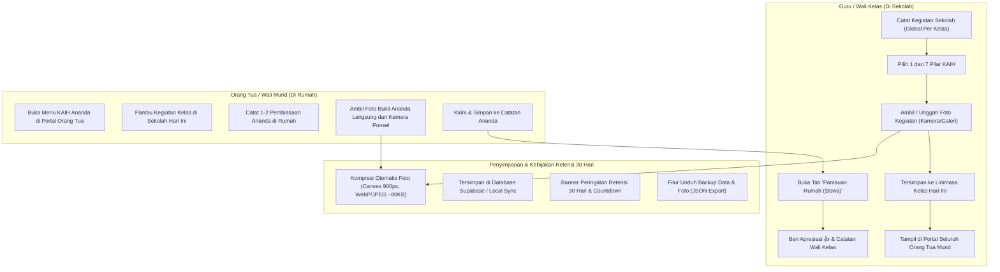

# Log Pembaruan & Rencana: Modul Karakter KAIH (7 Kebiasaan Anak Indonesia Hebat: Warisan ABAT)
**Tanggal**: 19 September 2026  
**Berkas Log**: `/logs/log-karakter-kaih.190926.md`  
**Aplikasi**: LAPIS LADA (Layanan Pusat Informasi Sekolah Latsari Dua)  
**Institusi**: UPT SD Negeri Latsari 2 Bancar, Tuban, Jawa Timur  
**Status**: ✅ Selesai Diimplementasikan, Teruji Build Produksi, & Terdeploy ke GitHub & Cloudflare Pages  

---

## 1. Latar Belakang & Intisari Kebutuhan (Voice Note Alignment)

Sebelumnya, halaman `/kaih` hanya berupa mockup checklist 7 kebiasaan statis yang tersimpan sementara di memori lokal per sesi browser tanpa pemisahan peran dan tanpa bukti foto.

Melalui arahan langsung (*voice note*), sistem Karakter KAIH dirombak secara menyeluruh menjadi platform pemantauan pembiasaan karakter dua arah:

1. **Pencatatan Guru (Di Sekolah) Bersifat Global per Kelas**:
   - Guru wali kelas mencatat kegiatan pembiasaan kelas pada hari itu secara dinamis (tidak *hardcoded*), seperti *Sholat Dhuha Berjamaah*, *Senam Pagi Kebugaran*, atau *Literasi 15 Menit*.
   - Setiap kegiatan dikaitkan dengan salah satu dari 7 Pilar KAIH, dilengkapi jam kegiatan dan foto dokumentasi.
   - Hasil pencatatan otomatis terdistribusi ke seluruh wali murid di kelas tersebut sehingga orang tua mengetahui kegiatan positif ananda di sekolah.

2. **Pencatatan Orang Tua (Di Rumah) Bersifat Personal per Siswa**:
   - Ketika ananda pulang ke rumah, orang tua mencatat minimal 1 atau 2 pembiasaan baik yang dilakukan anak di rumah (misalnya: *Merapikan tempat tidur*, *Sholat maghrib berjamaah*, *Membantu pekerjaan rumah*).
   - Orang tua dapat langsung mengunggah foto bukti kegiatan dari rumah.
   - Guru/wali kelas dapat memantau catatan rumah masing-masing siswa dan memberikan respon atau apresiasi.

3. **Kemudahan Unggah Foto & Kompresi Otomatis Klien**:
   - Input file mendukung `accept="image/*"` yang otomatis membuka kamera ponsel (*camera capture*) atau galeri foto di perangkat smartphone tanpa perlu input manual URL gambar.
   - Foto dikompresi otomatis di sisi browser (*client-side canvas resizer*) menjadi WebP/JPEG ringan (~60–120 KB), menjamin proses unggah instan dan hemat kuota.

4. **Kebijakan Retensi Penyimpanan Foto 30 Hari**:
   - Foto dokumentasi kegiatan dibatasi masa simpannya selama 30 hari untuk efisiensi ruang server.
   - Dilengkapi *Banner Peringatan Retensi 30 Hari* dengan hitung mundur sisa hari masa simpan serta tombol **"Cadangkan / Ekspor Data"** untuk mengunduh arsip JSON dan foto ke perangkat lokal pengguna.

---

## 2. Diagram Alur Kerja Sistem (Workflow Architecture)

---

## 3. Rincian Implementasi & Perubahan Kode

### A. Skema Database Supabase & Row Level Security (`supabase-schema.sql`)
- Menambahkan definisi tabel baru `public.kaih_kegiatan`:
  - `id`: UUID (Primary Key)
  - `tipe`: `TEXT` CHECK (`tipe IN ('sekolah', 'rumah')`)
  - `kelas_id`: UUID (FK ke `public.kelas`)
  - `siswa_id`: UUID (FK ke `public.siswa`, NULL untuk kegiatan sekolah)
  - `kategori_id`: INT (1 s/d 7)
  - `kategori_nama`: TEXT
  - `judul`: TEXT
  - `deskripsi`: TEXT
  - `jam`: TEXT (misal `07:15 WIB`)
  - `tanggal`: DATE DEFAULT CURRENT_DATE
  - `foto_url`: TEXT (Data URL / Supabase Storage path)
  - `created_by`: UUID (FK ke `public.users_profile`)
  - `creator_nama`: TEXT
  - `apresiasi_guru`: BOOLEAN DEFAULT FALSE
  - `catatan_guru`: TEXT
  - `created_at`: TIMESTAMPTZ DEFAULT NOW()
- Mengaktifkan Row Level Security (`ALTER TABLE public.kaih_kegiatan ENABLE ROW LEVEL SECURITY;`):
  - Policy Baca: Guru & Admin dapat membaca semua kegiatan; Orang Tua dapat membaca kegiatan sekolah global kelasnya dan kegiatan rumah anandanya.
  - Policy Input/Kelola: Guru & Admin mengelola kegiatan sekolah; Orang Tua mengelola kegiatan rumah untuk anandanya sendiri.

### B. Definisi Tipe & Kompresi Sisi Klien (`src/lib/supabase.ts`)
- Menambahkan tipe `KaihKegiatan` dan antarmuka `PilarKaih`.
- Mendefinisikan konstanta `PILAR_KAIH` berisi 7 pilar kebiasaan:
  1. Bangun Pagi & Merapikan Tempat Tidur (Disiplin)
  2. Beribadah Tepat Waktu (Religius)
  3. Berolahraga / Aktivitas Fisik (Kebugaran)
  4. Gemar Belajar & Membaca Buku (Literasi)
  5. Makan Makanan Bergizi Seimbang (Gizi Sehat)
  6. Bermasyarakat & Membantu Orang Tua (Gotong Royong)
  7. Tidur Cepat Tepat Waktu (Kesehatan)
- Mengimplementasikan helper `compressImageFile(file: File, maxWidth = 900, maxHeight = 900, quality = 0.75)` berbasis *HTML5 Canvas* yang menghasilkan Data URL WebP/JPEG ringan secara instan.

### C. Data Inisial Fallback (`src/lib/kaihData.ts`)
- Menyediakan data demo realistis untuk kegiatan sekolah (Sholat Dhuha, Senam Bersama) dan kegiatan rumah ananda (Bangun subuh merapikan kamar, Sarapan bergizi) sehingga aplikasi tetap berfungsi mulus sebelum eksekusi migrasi remote SQL.

### D. Perombakan Total Halaman KAIH (`src/app/kaih/page.tsx`)
- **Deteksi Peran Dinamis**:
  - Mendeteksi peran pengguna dari sesi login Supabase atau parameter rute `?role=orangtua`.
- **Tampilan Guru / Wali Kelas**:
  - **Banner Peringatan Retensi 30 Hari**: Info masa simpan, countdown sisa hari, dan tombol **"Cadangkan / Ekspor Data"**.
  - **Tab 1: Kegiatan Sekolah (Global Kelas)**: Feed kegiatan harian kelas, tombol modal `+ Catat Kegiatan Sekolah Hari Ini`, pemilih pilar KAIH, jam, dan upload foto kamera/galeri.
  - **Tab 2: Pantauan Rumah (Siswa)**: Filter tanggal dan filter dropdown nama siswa Kelas 4A, tampilan foto bukti kiriman orang tua, dan tombol interaktif **"Beri Apresiasi 👍"**.
  - **Tab 3: 7 Pilar KAIH (Panduan)**: Kartu edukasi nilai karakter dan indikator pembiasaan.
- **Tampilan Orang Tua Murid**:
  - **Kegiatan Kelas Hari Ini**: Menampilkan feed kegiatan sekolah ananda yang dicatat wali kelas pada hari bersangkutan.
  - **Catat Pembiasaan Ananda di Rumah**: Form pencatatan pembiasaan rumah (1–2 kegiatan), tombol kamera HP/galeri, dan tombol simpan.
  - **Riwayat Pembiasaan Ananda di Rumah**: Kartu riwayat kegiatan ananda beserta lencana status apresiasi dari wali kelas.
- **Boundary Suspense**:
  - Membungkus konten halaman dalam `<Suspense>` boundary untuk memenuhi standar prerendering Next.js 16.3.5.

### E. Integrasi Dashboard Orang Tua & Navigasi Mobile
- **Dashboard Orang Tua (`src/app/dashboard/orangtua/page.tsx`)**:
  - Menambahkan kartu **"Karakter KAIH Ananda"** setelah seksi kehadiran dengan status pengisian harian dan tombol cepat `+ Catat & Foto Bukti Hari Ini`.
- **Navigasi Global (`src/components/layout/AppShell.tsx` & `src/components/layout/BottomNav.tsx`)**:
  - Menambahkan menu `Karakter KAIH` (ikon `HeartHandshake`) pada menu sidebar orang tua dan bilah navigasi bawah mobile (*BottomNav*).

---

## 4. Status Deployment & Riwayat Rilis

### A. GitHub Repository
- **Remote**: `https://github.com/jfmprinting/lapislada.git`
- **Branch**: `main`
- **Commit ID**: `e40fd43`
- **Pesan Commit**: `feat(kaih): implement dual-role KAIH (school global feed vs home habits), instant photo upload & compression, and 30-day retention warning with backup`

### B. Cloudflare Pages
- **Mekanisme**: Static Export build (`out/`) via Wrangler CLI (`npx wrangler pages deploy out --project-name=lapislada`).
- **Domain Produksi**: [https://lapislada-c33.pages.dev/kaih](https://lapislada-c33.pages.dev/kaih)
- **Deployment Preview ID**: [https://8c4655c7.lapislada-c33.pages.dev/kaih](https://8c4655c7.lapislada-c33.pages.dev/kaih)
- **Hasil Verifikasi HTTP**: 200 OK, seluruh halaman berhasil dirender dengan mulus.

---

## 5. Matriks Status Fitur (Feature Status Matrix)

| Fitur / Komponen | Target Pengguna | Status | Keterangan |
|---|---|---|---|
| **Pencatatan Global Sekolah** | Guru / Wali Kelas | ✅ Selesai | Feed kelas per tanggal, pilih 7 pilar, jam & foto |
| **Pencatatan Mandiri di Rumah** | Orang Tua Murid | ✅ Selesai | Khusus ananda, minimal 1-2 kegiatan, foto kamera/galeri |
| **Kompresi Foto Instan** | Guru & Orang Tua | ✅ Selesai | Canvas resizer max 900px (~80KB), hemat kuota |
| **Banner Retensi 30 Hari** | Admin & Guru | ✅ Selesai | Info masa simpan foto & tombol unduh backup JSON |
| **Apresiasi Guru Dua Arah** | Guru & Orang Tua | ✅ Selesai | Guru memberi respon apresiasi yang terlihat di akun ortu |
| **Widget Dashboard Ortu** | Orang Tua Murid | ✅ Selesai | Pintasan langsung dari `/dashboard/orangtua` |
| **Build & Deploy Produksi** | Seluruh Pengguna | ✅ Selesai | Live di `lapislada-c33.pages.dev` & branch `main` |
